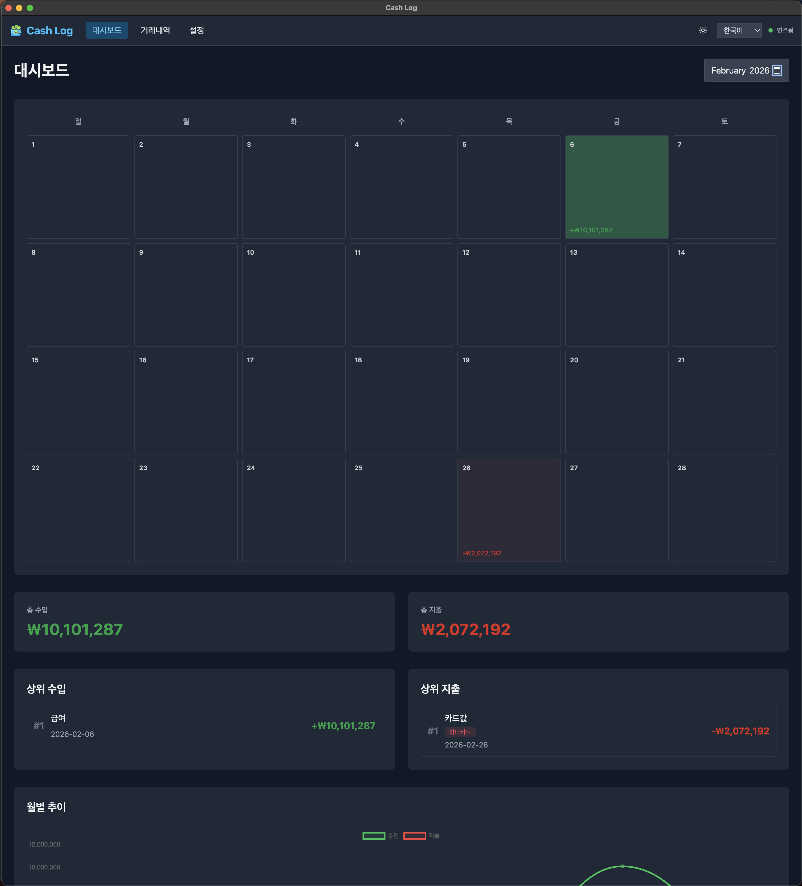
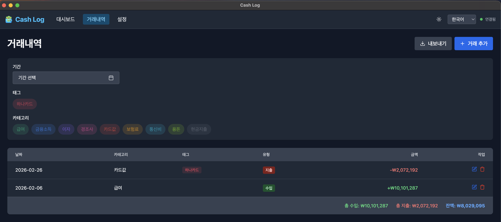
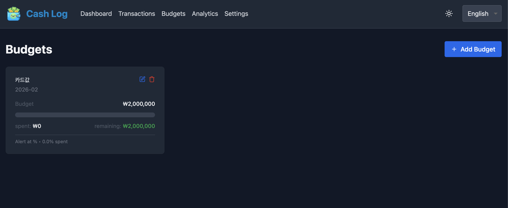
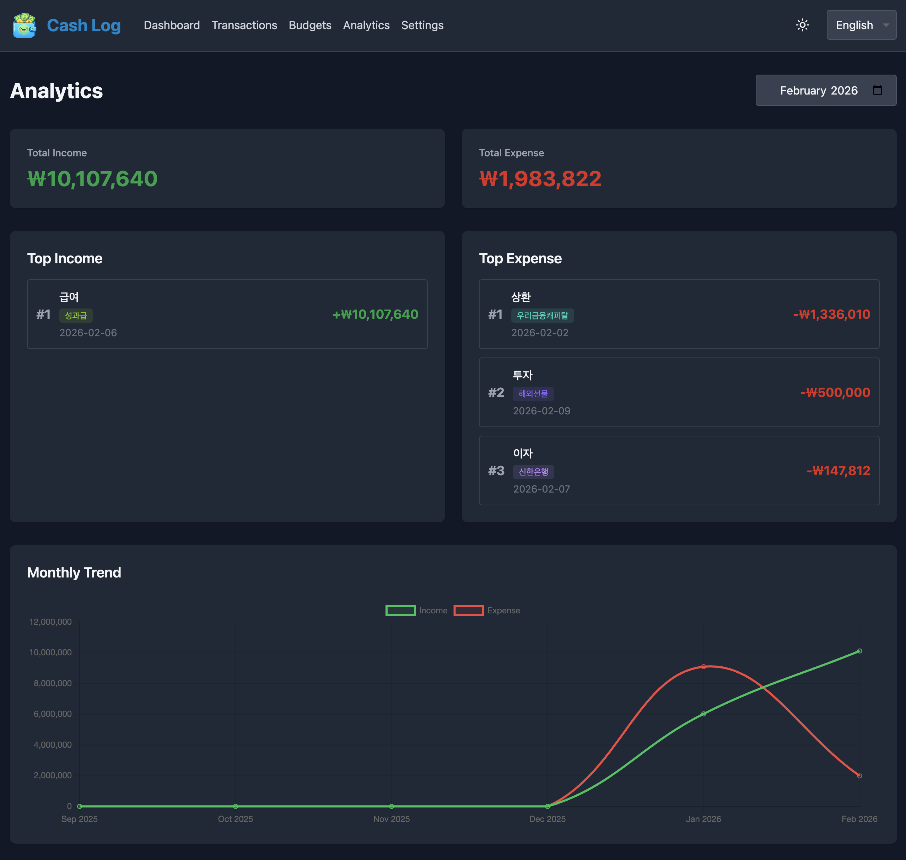
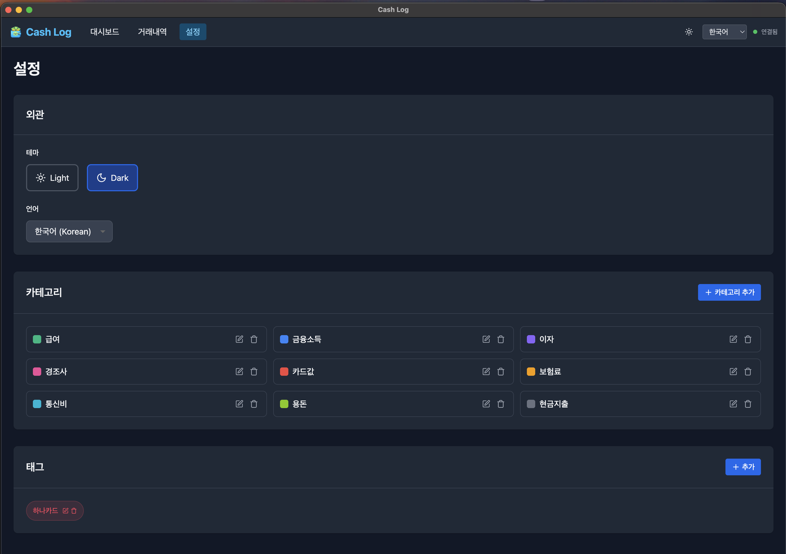

# 💰 cash-log
> 간단한 개인 재무 관리 애플리케이션. Powered by [AI-DLC(v0.1.3)](https://github.com/awslabs/aidlc-workflows).

## 📸 스크린샷

### 대시보드


### 거래 내역


### 예산 관리


### 분석


### 설정


## ✨ 주요 기능

### 1. 📅 수입/지출 내역 관리
- **수입/지출 기록**: 날짜, 금액, 태그, 메모를 포함한 간편한 데이터 입력
- **태그 커스터마이징**: 식비, 교통비, 쇼핑 등 본인의 라이프스타일에 맞춘 분류 설정
- **필터링 & 검색**: 기간별, 태그별로 과거 내역을 빠르게 조회

### 2. 📊 데이터 시각화 (Insights)
- **통계 대시보드**: 월별 지출 추이를 차트로 한눈에 확인
- **태그별 비중**: 어떤 곳에 가장 많은 돈을 썼는지 파이 차트로 분석

### 3. 🎯 예산 설정 및 알림
- **월간 예산 설정**: 이번 달 사용할 목표 금액을 설정하고 잔액 확인
- **소비 경고**: 예산의 일정 비율(예: 80%, 100%) 초과 시 시각적 알림 제공

### 4. 💾 데이터 영속성
- **로컬 DB 저장**: 작성한 내역이 휘발되지 않도록 안전하게 데이터 저장
- **보고서 생성 기능**: 기록된 데이터를 CSV, EXCEL, PDF 파일로 저장

## 🚀 시작하기

### 사전 요구사항
- **Docker** 20.10+
- **Docker Compose** 2.0+
- **Java** 21+
- **Node.js** 18+
- **Maven** 3.6+ (wrapper 포함)

### 빠른 설정

1. **저장소 클론**
```bash
git clone <repository-url>
cd cash-log
```

2. **인프라 설정 (데이터베이스)**
```bash
# 초기 설정
./infrastructure/scripts/setup.sh

# .env 파일을 편집하여 안전한 비밀번호 설정
nano infrastructure/docker/.env

# MySQL 데이터베이스 시작
./infrastructure/scripts/start.sh
```

3. **백엔드 설정**
```bash
# 환경 변수 설정 (infrastructure/docker/.env와 동일한 비밀번호 사용)
export DB_USER=cashlog
export DB_PASSWORD=<your-secure-password>
```

4. **백엔드 실행**
```bash
cd apps/backend
./mvnw spring-boot:run
```

5. **프론트엔드 실행**
```bash
cd apps/frontend
npm install
npm run dev
```

6. **애플리케이션 접속**
- 프론트엔드: http://localhost:3000
- 백엔드 API: http://localhost:8080
- API 문서: http://localhost:8080/swagger-ui.html

## 📁 프로젝트 구조

```
cash-log/
├── apps/
│   ├── backend/          # Spring Boot 백엔드
│   └── frontend/         # Next.js 프론트엔드
├── infrastructure/       # Docker 인프라
│   ├── docker/          # Docker Compose 설정
│   └── scripts/         # 설정 및 관리 스크립트
└── aidlc-docs/          # AI-DLC 문서
```

## 🔒 보안 주의사항

⚠️ **중요**: 민감한 정보를 Git에 커밋하지 마세요!

- `.env` 파일은 Git에서 무시됩니다
- 항상 강력하고 고유한 비밀번호를 사용하세요
- `infrastructure/docker/.env`의 기본 비밀번호를 변경하세요
- 백엔드 실행 전 환경 변수를 설정하세요

## 📚 문서

자세한 빌드 및 테스트 지침은 다음을 참조하세요:
- [빌드 지침](./aidlc-docs/construction/build-and-test/build-instructions.md)
- [단위 테스트 지침](./aidlc-docs/construction/build-and-test/unit-test-instructions.md)
- [통합 테스트 지침](./aidlc-docs/construction/build-and-test/integration-test-instructions.md)

## 🛠️ 개발

### 백엔드 개발
```bash
cd apps/backend
export DB_USER=cashlog
export DB_PASSWORD=<your-password>
./mvnw spring-boot:run -Dspring-boot.run.profiles=dev
```

### 프론트엔드 개발
```bash
cd apps/frontend
npm run dev
```

### 테스트 실행
```bash
# 백엔드 테스트
cd apps/backend
./mvnw test

# 프론트엔드 테스트
cd apps/frontend
npm test
```

## 📝 라이선스

이 프로젝트는 MIT 라이선스에 따라 라이선스가 부여됩니다 - 자세한 내용은 [LICENSE](LICENSE) 파일을 참조하세요.
