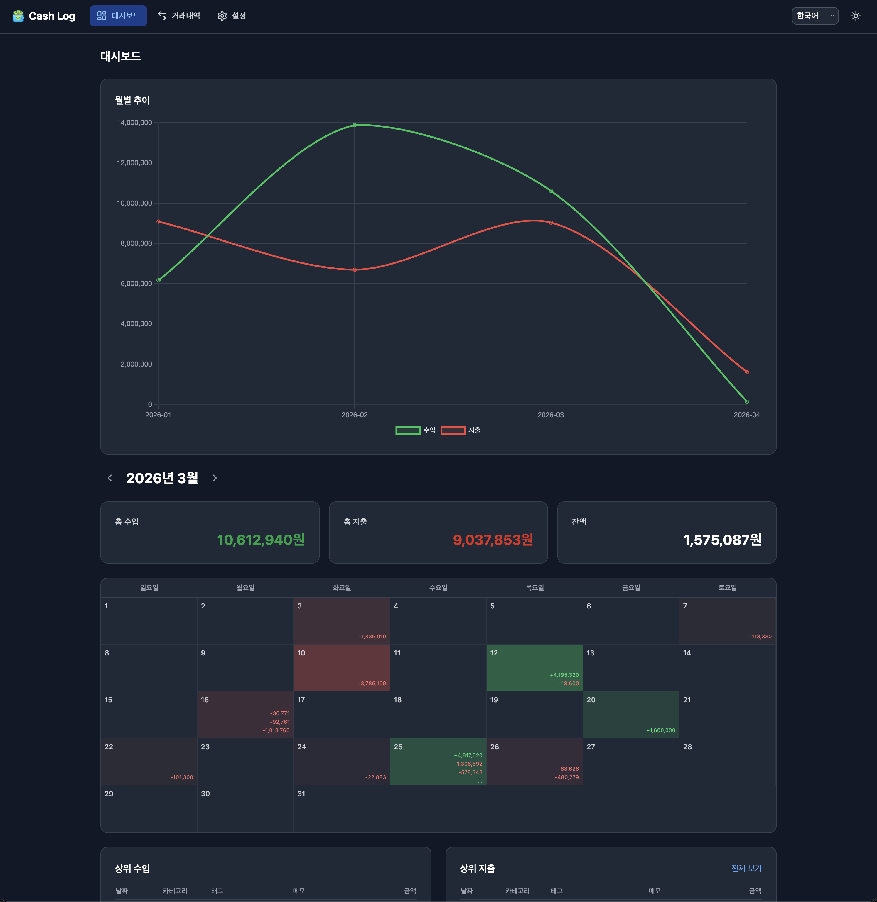

# 💰 Cash Log

간단한 개인 재무 관리 **웹 애플리케이션**. React + Spring Boot + MySQL 기반, Docker Compose로 배포.

## 📸 미리보기



## ✨ 주요 기능

### 📅 수입/지출 내역 관리
- 날짜, 금액, 카테고리, 태그, 메모를 포함한 거래 기록
- 다중 통화 지원 (KRW, USD, EUR, JPY) — 원화 환산 금액 자동 저장
- 카테고리 관리 (색상 지정 가능)
- 태그 시스템 (거래당 여러 태그, 색상 지정 가능)
- 기간별, 유형별, 카테고리별, 태그별 필터링

### 📊 데이터 시각화
- **월별 추이 차트**: 수입/지출 라인 차트 (클릭하여 월 선택)
- **월별 캘린더**: 일별 수입/지출 히트맵, 호버 시 상세 툴팁
- **카테고리별 분석**: 파이 차트
- **태그별 분석**: 바 차트
- **Top 거래**: 상위 5건 수입/지출 테이블

### 💾 데이터 관리
- MySQL 영속 저장 (Docker 볼륨)
- CSV, Excel, PDF 내보내기

### 🌐 다국어 & 다크 모드
- 한국어 / English 지원
- 라이트 / 다크 테마

## 🛠️ 기술 스택

### 프론트엔드
| 기술 | 버전 |
|------|------|
| React | 18 |
| TypeScript | 5.3 |
| Vite | 5 |
| Tailwind CSS | 3.4 |
| Zustand | 4.5 |
| Chart.js | 4.4 |
| React Router | 6.22 |
| Nginx | Alpine (배포) |

### 백엔드
| 기술 | 버전 |
|------|------|
| Java | 21 |
| Spring Boot | 3.2.2 |
| Spring Data JPA | - |
| Flyway | - |
| Apache POI | Excel 내보내기 |
| OpenCSV | CSV 내보내기 |
| iText 8 | PDF 내보내기 |
| SpringDoc OpenAPI | API 문서 |

### 인프라
| 기술 | 버전 |
|------|------|
| MySQL | 8.0 |
| Docker Compose | - |
| Nginx | Alpine |

## 📁 프로젝트 구조

```
cash-log/
├── apps/
│   ├── backend/             # Spring Boot REST API
│   │   ├── src/main/java/   # Controller, Service, Repository, Entity, DTO
│   │   ├── src/main/resources/  # application.yml, Flyway migrations
│   │   ├── Dockerfile
│   │   └── pom.xml
│   └── frontend/            # React SPA
│       ├── src/
│       │   ├── pages/       # DashboardPage, TransactionsPage, SettingsPage
│       │   ├── components/  # UI 컴포넌트, 차트, 모달
│       │   ├── lib/         # API 클라이언트, Zustand 스토어, i18n
│       │   └── types/       # TypeScript 타입 정의
│       ├── nginx.conf
│       └── Dockerfile
├── infrastructure/
│   └── docker/              # 개발용 MySQL Docker Compose
├── docker-compose.yml       # 전체 스택 배포
└── .env.example
```

## 🚀 시작하기

### 사전 요구사항
- **Docker Desktop** 20.10+

### 빠른 시작

1. **환경 변수 설정**
```bash
cp .env.example .env
# .env 파일을 편집하여 비밀번호 설정
```

2. **전체 스택 실행**
```bash
docker compose up --build -d
```

3. **접속**
- 웹 앱: http://localhost
- API 문서: http://localhost/swagger-ui/index.html

### 개발 모드

개발 시에는 프론트엔드와 백엔드를 별도로 실행합니다.

1. **MySQL 실행**
```bash
cd infrastructure/docker
cp .env.example .env  # 비밀번호 설정
docker compose up -d
```

2. **백엔드 실행**
```bash
cd apps/backend
export DB_USER=cashlog
export DB_PASSWORD=<your-password>
./mvnw spring-boot:run
```

3. **프론트엔드 실행**
```bash
cd apps/frontend
npm install
npm run dev
```
- 프론트엔드: http://localhost:5173
- 백엔드 API: http://localhost:8080
- API 문서: http://localhost:8080/swagger-ui.html

## 📡 API 엔드포인트

| 리소스 | 메서드 | 경로 | 설명 |
|--------|--------|------|------|
| 거래 | POST | `/api/transactions` | 거래 생성 |
| | GET | `/api/transactions` | 거래 목록 (날짜 필터 지원) |
| | GET | `/api/transactions/{id}` | 거래 상세 |
| | PUT | `/api/transactions/{id}` | 거래 수정 |
| | DELETE | `/api/transactions/{id}` | 거래 삭제 |
| 카테고리 | GET/POST/PUT/DELETE | `/api/categories` | CRUD |
| 태그 | GET/POST/PUT/DELETE | `/api/tags` | CRUD |
| 내보내기 | GET | `/api/export/csv` | CSV 다운로드 |
| | GET | `/api/export/excel` | Excel 다운로드 |
| | GET | `/api/export/pdf` | PDF 다운로드 |
| 분석 | GET | `/api/analytics/monthly-summary` | 월별 요약 |
| 세션 | GET/PUT | `/api/session/{key}` | 사용자 설정 |

## 🧪 테스트

```bash
# 백엔드 테스트
cd apps/backend
./mvnw test

# 프론트엔드 테스트
cd apps/frontend
npm test
```

## 🏗️ 배포 아키텍처

```
┌─────────────┐     ┌──────────────┐     ┌─────────┐
│   Nginx     │────▶│  Spring Boot │────▶│  MySQL  │
│  (port 80)  │     │  (port 8080) │     │ (3306)  │
│  + React    │     │  REST API    │     │         │
│  SPA        │     │              │     │         │
└─────────────┘     └──────────────┘     └─────────┘
   frontend            backend             mysql
```

- Nginx가 정적 파일(React SPA)을 서빙하고, `/api/` 요청을 백엔드로 프록시
- 백엔드는 Docker 네트워크 내부에서만 접근 가능 (호스트에 포트 노출 안 함)
- MySQL 데이터는 Docker 볼륨(`docker_mysql-data`)에 영속 저장

## 📝 라이선스

MIT License — [LICENSE](LICENSE) 참조.
