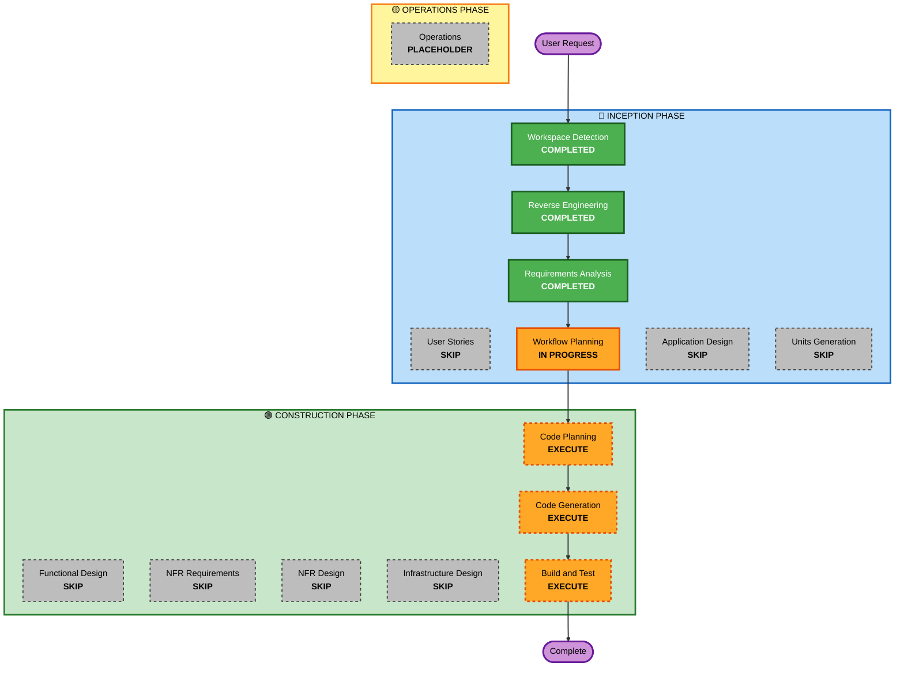

# Execution Plan

## Detailed Analysis Summary

### Transformation Scope
- **Transformation Type**: Single component enhancement (Frontend only)
- **Primary Changes**: Adding missing UI components and features to existing Next.js frontend
- **Related Components**: Frontend pages, components, stores (no backend changes)

### Change Impact Assessment
- **User-facing changes**: Yes - New modals, charts, filters, and settings page
- **Structural changes**: No - Using existing architecture and patterns
- **Data model changes**: No - Using existing API contracts
- **API changes**: No - All required endpoints already exist in backend
- **NFR impact**: Yes - Accessibility, i18n, responsive design for all new components

### Component Relationships
**Primary Component**: Frontend (apps/frontend)
- **Infrastructure Components**: None
- **Shared Components**: None
- **Dependent Components**: Backend API (no changes needed)
- **Supporting Components**: None

### Risk Assessment
- **Risk Level**: Low
- **Rollback Complexity**: Easy - Frontend-only changes, no database migrations
- **Testing Complexity**: Simple - Manual testing of UI components

---

## Workflow Visualization

---

## Phases to Execute

### 🔵 INCEPTION PHASE
- [x] Workspace Detection (COMPLETED)
- [x] Reverse Engineering (COMPLETED)
- [x] Requirements Analysis (COMPLETED)
- [x] Workflow Planning (IN PROGRESS)
- [ ] User Stories - SKIP
  - **Rationale**: Simple enhancement work with clear requirements. User stories would add overhead without significant value. Requirements document already provides sufficient detail.
- [ ] Application Design - SKIP
  - **Rationale**: No new components or services needed. All work follows existing patterns (modals, forms, charts). Component structure already defined in requirements.
- [ ] Units Generation - SKIP
  - **Rationale**: Single unit of work (frontend enhancements). No need to decompose into multiple units. All changes are cohesive frontend additions.

### 🟢 CONSTRUCTION PHASE
- [ ] Functional Design - SKIP
  - **Rationale**: UI component implementation with clear requirements. No complex business logic. Following existing patterns from TransactionFormModal.
- [ ] NFR Requirements - SKIP
  - **Rationale**: NFR requirements already captured in requirements document (accessibility, i18n, responsive design, error handling). Tech stack already determined (existing technologies).
- [ ] NFR Design - SKIP
  - **Rationale**: No new NFR patterns needed. Using existing patterns for forms, modals, error handling, and state management.
- [ ] Infrastructure Design - SKIP
  - **Rationale**: No infrastructure changes. Frontend-only work using existing deployment model.
- [ ] Code Planning - EXECUTE (ALWAYS)
  - **Rationale**: Need detailed implementation plan for 8 functional requirements across multiple components
- [ ] Code Generation - EXECUTE (ALWAYS)
  - **Rationale**: Implement all missing frontend features
- [ ] Build and Test - EXECUTE (ALWAYS)
  - **Rationale**: Verify all components work correctly and integrate properly

### 🟡 OPERATIONS PHASE
- [ ] Operations - PLACEHOLDER
  - **Rationale**: Future deployment and monitoring workflows

---

## Estimated Timeline
- **Total Phases**: 3 (Code Planning, Code Generation, Build and Test)
- **Estimated Duration**: 1-2 hours for planning and implementation

---

## Success Criteria
- **Primary Goal**: Complete all 8 missing frontend features
- **Key Deliverables**: 
  - Budget form modal
  - Tag management modal
  - Export dialog
  - Analytics charts (line + pie)
  - Transaction filtering
  - Analytics filtering
  - Budget progress tracking
  - Settings page
- **Quality Gates**: 
  - All components mobile-responsive
  - Accessibility maintained (ARIA labels, keyboard navigation)
  - Korean/English translations for all new text
  - Basic error handling and validation
  - Integration with existing stores and API
