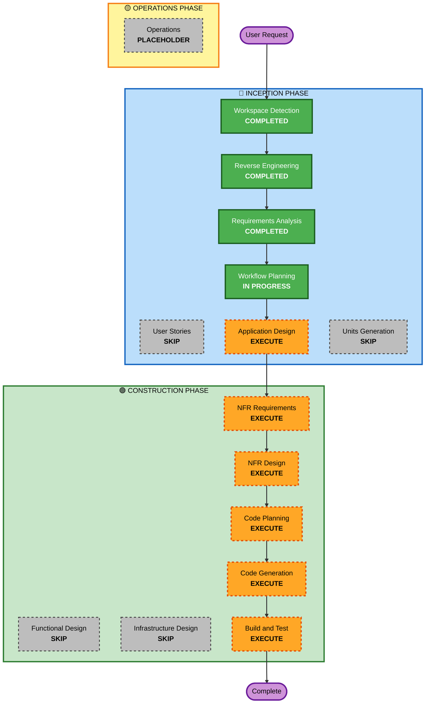

# Execution Plan - Electron Desktop App Migration

## Detailed Analysis Summary

### Transformation Scope
- **Transformation Type**: Architectural transformation (Web → Desktop)
- **Primary Changes**: Complete frontend framework migration (Next.js → React + Electron)
- **Related Components**: 
  - apps/frontend (complete transformation)
  - apps/backend (unchanged)
  - infrastructure/docker (unchanged)

### Change Impact Assessment
- **User-facing changes**: Yes - Desktop application with native features (system tray, notifications, file dialogs)
- **Structural changes**: Yes - Complete frontend architecture change, routing rebuild, entry point changes
- **Data model changes**: No - Backend and database remain unchanged
- **API changes**: No - Existing Spring Boot API remains unchanged
- **NFR impact**: Yes - Desktop performance requirements, macOS-specific optimizations

### Component Relationships
```
Primary Component: apps/frontend (MAJOR TRANSFORMATION)
├── Backend API: apps/backend (NO CHANGE - existing API reused)
├── Database: MySQL (NO CHANGE)
├── Infrastructure: Docker setup (NO CHANGE)
└── Build System: Complete rebuild (Next.js → Electron build)
```

**Component Change Details**:
- **apps/frontend**: Major transformation
  - Change Type: Complete framework migration
  - Change Reason: Technology stack change (Next.js → Electron)
  - Change Priority: Critical
- **apps/backend**: No changes
  - Existing Spring Boot API reused as-is
- **infrastructure**: No changes
  - MySQL Docker setup remains unchanged

### Risk Assessment
- **Risk Level**: High
- **Rationale**: 
  - Complete framework migration with significant architectural changes
  - Desktop-specific features require new implementation patterns
  - Component reuse strategy needs careful execution
  - No rollback to web version (complete replacement)
- **Rollback Complexity**: Difficult (complete replacement, no parallel deployment)
- **Testing Complexity**: Moderate (unit tests + manual desktop testing)

---

## Workflow Visualization


```mermaid
flowchart TD
    Start(["User Request"])
    
    subgraph INCEPTION["🔵 INCEPTION PHASE"]
        WD["Workspace Detection<br/><b>COMPLETED</b>"]
        RE["Reverse Engineering<br/><b>COMPLETED</b>"]
        RA["Requirements Analysis<br/><b>COMPLETED</b>"]
        US["User Stories<br/><b>SKIP</b>"]
        WP["Workflow Planning<br/><b>IN PROGRESS</b>"]
        AD["Application Design<br/><b>EXECUTE</b>"]
        UG["Units Generation<br/><b>SKIP</b>"]
    end
    
    subgraph CONSTRUCTION["🟢 CONSTRUCTION PHASE"]
        FD["Functional Design<br/><b>SKIP</b>"]
        NFRA["NFR Requirements<br/><b>EXECUTE</b>"]
        NFRD["NFR Design<br/><b>EXECUTE</b>"]
        ID["Infrastructure Design<br/><b>SKIP</b>"]
        CP["Code Planning<br/><b>EXECUTE</b>"]
        CG["Code Generation<br/><b>EXECUTE</b>"]
        BT["Build and Test<br/><b>EXECUTE</b>"]
    end
    
    subgraph OPERATIONS["🟡 OPERATIONS PHASE"]
        OPS["Operations<br/><b>PLACEHOLDER</b>"]
    end
    
    Start --> WD
    WD --> RE
    RE --> RA
    RA --> WP
    WP --> AD
    AD --> NFRA
    NFRA --> NFRD
    NFRD --> CP
    CP --> CG
    CG --> BT
    BT --> End(["Complete"])
    
    style WD fill:#4CAF50,stroke:#1B5E20,stroke-width:3px,color:#fff
    style RE fill:#4CAF50,stroke:#1B5E20,stroke-width:3px,color:#fff
    style RA fill:#4CAF50,stroke:#1B5E20,stroke-width:3px,color:#fff
    style WP fill:#4CAF50,stroke:#1B5E20,stroke-width:3px,color:#fff
    style AD fill:#FFA726,stroke:#E65100,stroke-width:3px,stroke-dasharray: 5 5,color:#000
    style NFRA fill:#FFA726,stroke:#E65100,stroke-width:3px,stroke-dasharray: 5 5,color:#000
    style NFRD fill:#FFA726,stroke:#E65100,stroke-width:3px,stroke-dasharray: 5 5,color:#000
    style CP fill:#FFA726,stroke:#E65100,stroke-width:3px,stroke-dasharray: 5 5,color:#000
    style CG fill:#FFA726,stroke:#E65100,stroke-width:3px,stroke-dasharray: 5 5,color:#000
    style BT fill:#FFA726,stroke:#E65100,stroke-width:3px,stroke-dasharray: 5 5,color:#000
    style US fill:#BDBDBD,stroke:#424242,stroke-width:2px,stroke-dasharray: 5 5,color:#000
    style UG fill:#BDBDBD,stroke:#424242,stroke-width:2px,stroke-dasharray: 5 5,color:#000
    style FD fill:#BDBDBD,stroke:#424242,stroke-width:2px,stroke-dasharray: 5 5,color:#000
    style ID fill:#BDBDBD,stroke:#424242,stroke-width:2px,stroke-dasharray: 5 5,color:#000
    style OPS fill:#BDBDBD,stroke:#424242,stroke-width:2px,stroke-dasharray: 5 5,color:#000
    style Start fill:#CE93D8,stroke:#6A1B9A,stroke-width:3px,color:#000
    style End fill:#CE93D8,stroke:#6A1B9A,stroke-width:3px,color:#000
    style INCEPTION fill:#BBDEFB,stroke:#1565C0,stroke-width:3px,color:#000
    style CONSTRUCTION fill:#C8E6C9,stroke:#2E7D32,stroke-width:3px,color:#000
    style OPERATIONS fill:#FFF59D,stroke:#F57F17,stroke-width:3px,color:#000
    
    linkStyle default stroke:#333,stroke-width:2px
```

---

## Phases to Execute

### 🔵 INCEPTION PHASE
- [x] Workspace Detection - COMPLETED
  - **Rationale**: Analyzed existing brownfield project
- [x] Reverse Engineering - COMPLETED
  - **Rationale**: Existing system architecture documented
- [x] Requirements Analysis - COMPLETED
  - **Rationale**: Electron migration requirements gathered and clarified
- [ ] User Stories - SKIP
  - **Rationale**: Internal migration project, no user personas needed, clear technical requirements
- [x] Workflow Planning - IN PROGRESS
  - **Rationale**: Creating execution plan for migration
- [ ] Application Design - EXECUTE
  - **Rationale**: Need to design Electron app architecture, component structure, IPC communication, and desktop-specific patterns
- [ ] Units Generation - SKIP
  - **Rationale**: Single frontend transformation, no need for multiple units

### 🟢 CONSTRUCTION PHASE
- [ ] Functional Design - SKIP
  - **Rationale**: No new business logic or data models, reusing existing components
- [ ] NFR Requirements - EXECUTE
  - **Rationale**: Desktop-specific NFRs need assessment (Electron framework, build tools, packaging, performance)
- [ ] NFR Design - EXECUTE
  - **Rationale**: Need to design Electron architecture patterns, IPC mechanisms, native integrations, build pipeline
- [ ] Infrastructure Design - SKIP
  - **Rationale**: No infrastructure changes, backend and database unchanged
- [ ] Code Planning - EXECUTE (ALWAYS)
  - **Rationale**: Detailed implementation plan for framework migration
- [ ] Code Generation - EXECUTE (ALWAYS)
  - **Rationale**: Transform Next.js to Electron, implement desktop features
- [ ] Build and Test - EXECUTE (ALWAYS)
  - **Rationale**: Build Electron app, create DMG installer, test desktop features

### 🟡 OPERATIONS PHASE
- [ ] Operations - PLACEHOLDER
  - **Rationale**: Future deployment and monitoring workflows

---

## Execution Summary

**Total Stages**: 13
**Stages to Execute**: 9
- Workspace Detection ✓
- Reverse Engineering ✓
- Requirements Analysis ✓
- Workflow Planning (current)
- Application Design
- NFR Requirements
- NFR Design
- Code Planning
- Code Generation
- Build and Test

**Stages to Skip**: 4
- User Stories (no user personas needed)
- Units Generation (single unit transformation)
- Functional Design (no new business logic)
- Infrastructure Design (no infrastructure changes)

---

## Estimated Timeline

**Phase Breakdown**:
- Application Design: 1 session (Electron architecture, component structure)
- NFR Requirements: 1 session (Desktop NFRs, tech stack selection)
- NFR Design: 1 session (Electron patterns, IPC, native integrations)
- Code Planning: 1 session (Detailed migration steps)
- Code Generation: 2-3 sessions (Framework migration, desktop features)
- Build and Test: 1 session (Build setup, DMG creation, testing)

**Total Estimated Duration**: 7-9 sessions

---

## Success Criteria

### Primary Goal
Transform Next.js web app into Electron desktop app with feature parity and desktop-specific enhancements

### Key Deliverables
1. Electron app with React (no Next.js)
2. Reused React components, stores, types, API clients
3. Desktop-specific features (system tray, notifications, file dialogs)
4. macOS DMG installer
5. Build and test documentation

### Quality Gates
1. All existing features work in desktop app
2. Desktop-specific features implemented and tested
3. Performance meets requirements (< 3s startup, 60 FPS, < 200MB memory)
4. DMG installer builds successfully
5. Unit tests pass
6. Manual desktop testing complete

---

## Package Change Sequence

**Single Package Transformation**:
1. **apps/frontend** - Complete transformation (Next.js → Electron)
   - Remove Next.js dependencies
   - Add Electron dependencies
   - Rebuild app structure and entry points
   - Implement desktop features
   - Update build configuration

**No Changes Required**:
- apps/backend (Spring Boot API unchanged)
- infrastructure/docker (MySQL setup unchanged)
