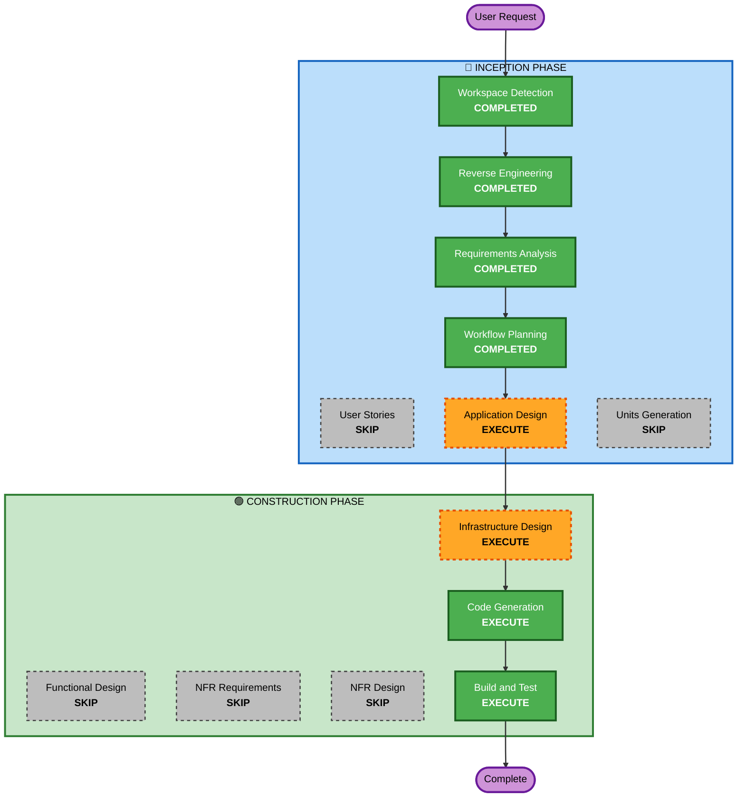

# Execution Plan

## Detailed Analysis Summary

### Transformation Scope
- **Transformation Type**: Architectural (Electron desktop → Web SPA)
- **Primary Changes**: 프론트엔드 전체 재작성 (Electron 제거, 순수 Vite+React SPA), Docker Compose 통합
- **Related Components**: Frontend (전면 재작성), Infrastructure (Docker Compose 추가), Backend (변경 없음)

### Change Impact Assessment
- **User-facing changes**: Yes — 데스크톱 앱에서 브라우저 기반 웹 앱으로 전환
- **Structural changes**: Yes — Electron 아키텍처 제거, SPA 구조로 전환
- **Data model changes**: No — 백엔드 DB 스키마 변경 없음
- **API changes**: No — 기존 REST API 그대로 사용
- **NFR impact**: Yes — 배포 모델 변경 (로컬 Electron → Docker Compose)

### Component Relationships
- **Primary Component**: `apps/frontend` (전면 재작성)
- **Infrastructure Components**: `infrastructure/docker` (Docker Compose 확장)
- **Dependent Components**: `apps/backend` (변경 없음, API 호환 유지)

### Risk Assessment
- **Risk Level**: Medium
- **Rollback Complexity**: Easy (기존 Electron 코드는 git에 보존)
- **Testing Complexity**: Moderate (새 프론트엔드 코드 + Docker Compose 통합 검증)

## Workflow Visualization

```mermaid
flowchart TD
    Start(["User Request"])
    
    subgraph INCEPTION["🔵 INCEPTION PHASE"]
        WD["Workspace Detection<br/><b>COMPLETED</b>"]
        RE["Reverse Engineering<br/><b>COMPLETED</b>"]
        RA["Requirements Analysis<br/><b>COMPLETED</b>"]
        US["User Stories<br/><b>SKIP</b>"]
        WP["Workflow Planning<br/><b>COMPLETED</b>"]
        AD["Application Design<br/><b>EXECUTE</b>"]
        UG["Units Generation<br/><b>SKIP</b>"]
    end
    
    subgraph CONSTRUCTION["🟢 CONSTRUCTION PHASE"]
        FD["Functional Design<br/><b>SKIP</b>"]
        NFRA["NFR Requirements<br/><b>SKIP</b>"]
        NFRD["NFR Design<br/><b>SKIP</b>"]
        ID["Infrastructure Design<br/><b>EXECUTE</b>"]
        CG["Code Generation<br/><b>EXECUTE</b>"]
        BT["Build and Test<br/><b>EXECUTE</b>"]
    end
    
    Start --> WD
    WD --> RE
    RE --> RA
    RA --> WP
    WP --> AD
    AD --> ID
    ID --> CG
    CG --> BT
    BT --> End(["Complete"])
    
    style WD fill:#4CAF50,stroke:#1B5E20,stroke-width:3px,color:#fff
    style RE fill:#4CAF50,stroke:#1B5E20,stroke-width:3px,color:#fff
    style RA fill:#4CAF50,stroke:#1B5E20,stroke-width:3px,color:#fff
    style WP fill:#4CAF50,stroke:#1B5E20,stroke-width:3px,color:#fff
    style AD fill:#FFA726,stroke:#E65100,stroke-width:3px,stroke-dasharray: 5 5,color:#000
    style ID fill:#FFA726,stroke:#E65100,stroke-width:3px,stroke-dasharray: 5 5,color:#000
    style CG fill:#4CAF50,stroke:#1B5E20,stroke-width:3px,color:#fff
    style BT fill:#4CAF50,stroke:#1B5E20,stroke-width:3px,color:#fff
    style US fill:#BDBDBD,stroke:#424242,stroke-width:2px,stroke-dasharray: 5 5,color:#000
    style UG fill:#BDBDBD,stroke:#424242,stroke-width:2px,stroke-dasharray: 5 5,color:#000
    style FD fill:#BDBDBD,stroke:#424242,stroke-width:2px,stroke-dasharray: 5 5,color:#000
    style NFRA fill:#BDBDBD,stroke:#424242,stroke-width:2px,stroke-dasharray: 5 5,color:#000
    style NFRD fill:#BDBDBD,stroke:#424242,stroke-width:2px,stroke-dasharray: 5 5,color:#000
    style Start fill:#CE93D8,stroke:#6A1B9A,stroke-width:3px,color:#000
    style End fill:#CE93D8,stroke:#6A1B9A,stroke-width:3px,color:#000
    style INCEPTION fill:#BBDEFB,stroke:#1565C0,stroke-width:3px,color:#000
    style CONSTRUCTION fill:#C8E6C9,stroke:#2E7D32,stroke-width:3px,color:#000
    
    linkStyle default stroke:#333,stroke-width:2px
```

## Phases to Execute

### 🔵 INCEPTION PHASE
- [x] Workspace Detection (COMPLETED)
- [x] Reverse Engineering (COMPLETED — from previous workflow)
- [x] Requirements Analysis (COMPLETED)
- [x] User Stories — SKIP
  - **Rationale**: 단일 사용자 개인 재무 앱, 기존 사용자 시나리오 변경 없음, 기술 마이그레이션에 해당
- [x] Workflow Planning (COMPLETED)
- [ ] Application Design — EXECUTE
  - **Rationale**: Electron 구조에서 순수 SPA 구조로 전환 시 새로운 컴포넌트 구조, 라우팅, 서비스 레이어 설계 필요
- [ ] Units Generation — SKIP
  - **Rationale**: 단일 유닛 (프론트엔드 웹 앱 + Docker Compose), 분해 불필요

### 🟢 CONSTRUCTION PHASE
- [ ] Functional Design — SKIP
  - **Rationale**: 비즈니스 로직 변경 없음, 기존 백엔드 API 그대로 사용
- [ ] NFR Requirements — SKIP
  - **Rationale**: 기술 스택 이미 결정 (Vite+React, TailwindCSS, Zustand), 이전 워크플로우에서 NFR 분석 완료
- [ ] NFR Design — SKIP
  - **Rationale**: NFR Requirements 스킵에 따라 스킵
- [ ] Infrastructure Design — EXECUTE
  - **Rationale**: Docker Compose 통합 (프론트엔드 Nginx + 백엔드 + MySQL) 설계 필요
- [ ] Code Generation — EXECUTE (ALWAYS)
  - **Rationale**: 프론트엔드 새로 작성, Dockerfile, Docker Compose 설정 생성
- [ ] Build and Test — EXECUTE (ALWAYS)
  - **Rationale**: 빌드, 테스트, Docker Compose 통합 검증

### 🟡 OPERATIONS PHASE
- [ ] Operations — PLACEHOLDER

## Success Criteria
- **Primary Goal**: Electron 데스크톱 앱을 브라우저 기반 웹 앱으로 전환
- **Key Deliverables**:
  - 순수 Vite + React SPA 프론트엔드
  - Docker Compose 통합 실행 환경
  - 기존 모든 기능 동작 (거래 관리, 대시보드, 설정, 내보내기)
- **Quality Gates**:
  - 프론트엔드 빌드 성공
  - `docker compose up`으로 전체 스택 실행
  - 기존 백엔드 API와 정상 통신
  - Security Baseline 규칙 준수
  - Property-Based Testing 규칙 준수
