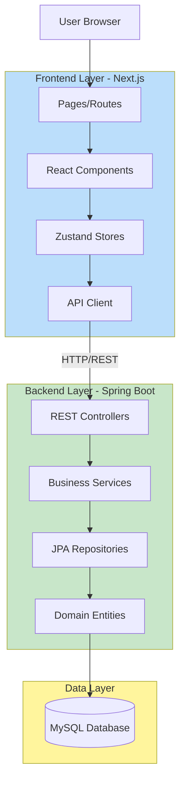
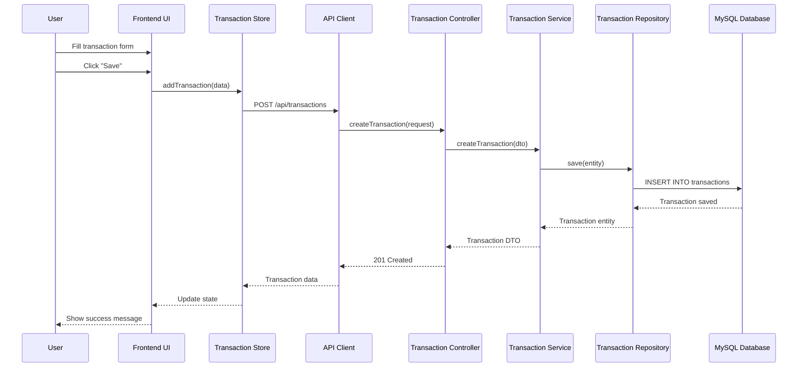

# System Architecture

## System Overview

Cash Log is a modern web application built with a microservices architecture, separating frontend and backend concerns. The system uses a RESTful API for communication between the Next.js frontend and Spring Boot backend, with MySQL as the persistent data store.

## Architecture Diagram

## Component Descriptions

### Frontend Application (apps/frontend)
- **Purpose**: Provides the user interface for personal finance management
- **Responsibilities**:
  - Render pages and components using React
  - Manage client-side state with Zustand
  - Handle routing with Next.js App Router
  - Make API calls to backend services
  - Support internationalization (i18n)
  - Implement responsive design with Tailwind CSS
- **Dependencies**: Backend API
- **Type**: Next.js 14 Application (TypeScript)

### Backend API (apps/backend)
- **Purpose**: Provides RESTful API for business logic and data management
- **Responsibilities**:
  - Handle HTTP requests and responses
  - Implement business logic for transactions, budgets, tags
  - Perform data validation and error handling
  - Generate analytics and reports
  - Export data in multiple formats (CSV, Excel, PDF)
  - Manage database operations through JPA
- **Dependencies**: MySQL Database
- **Type**: Spring Boot Application (Java 21)

### Database (MySQL)
- **Purpose**: Persistent storage for application data
- **Responsibilities**:
  - Store transactions, budgets, tags, and session data
  - Maintain data integrity with constraints
  - Support efficient querying with indexes
- **Type**: MySQL 8.0

## Data Flow

### Transaction Creation Flow

## Integration Points

### External APIs
- None (self-contained application)

### Databases
- **MySQL**: Primary data store for all application data
  - Transactions table
  - Budgets table
  - Tags table
  - Session preferences table

### Third-party Services
- None currently integrated

## Infrastructure Components

### Development Environment
- **Frontend**: Node.js 20.x, npm
- **Backend**: Java 21, Maven 3.8+
- **Database**: MySQL 8.0 (Docker container)

### Deployment Model
- **Frontend**: Next.js application (can be deployed to Vercel, AWS, etc.)
- **Backend**: Spring Boot JAR (can be deployed to AWS ECS, EC2, etc.)
- **Database**: MySQL instance (AWS RDS, Docker, etc.)

### Networking
- Frontend communicates with backend via HTTP REST API
- Backend connects to MySQL via JDBC
- CORS configured to allow frontend origin

### Monitoring
- Spring Boot Actuator endpoints available
- Swagger UI for API documentation at /swagger-ui.html
