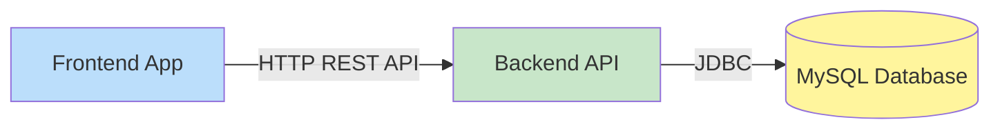

# Dependencies

## Internal Dependencies

### Frontend depends on Backend
- **Type**: Runtime
- **Reason**: Frontend makes HTTP requests to backend API for all data operations

### Backend depends on MySQL
- **Type**: Runtime
- **Reason**: Backend stores and retrieves all application data from MySQL database

## External Dependencies

### Frontend External Dependencies
- **next**: 14.x - React framework (MIT License)
- **react**: 18.x - UI library (MIT License)
- **zustand**: 4.x - State management (MIT License)
- **tailwindcss**: 3.x - CSS framework (MIT License)
- **react-hook-form**: 7.x - Form handling (MIT License)
- **chart.js**: 4.x - Charting (MIT License)
- **next-intl**: 3.x - Internationalization (MIT License)
- **lucide-react**: Latest - Icon library (ISC License)
- **date-fns**: 3.x - Date utilities (MIT License)

### Backend External Dependencies
- **spring-boot-starter-web**: 3.x - Web framework (Apache 2.0)
- **spring-boot-starter-data-jpa**: 3.x - Data access (Apache 2.0)
- **mysql-connector-j**: 8.x - MySQL driver (GPL 2.0 with FOSS exception)
- **lombok**: 1.18.x - Boilerplate reduction (MIT License)
- **springdoc-openapi-starter-webmvc-ui**: 2.x - API docs (Apache 2.0)
- **flyway-core**: 9.x - Database migrations (Apache 2.0)
- **apache-poi**: 5.x - Excel export (Apache 2.0)
- **itext7-core**: 7.x - PDF generation (AGPL 3.0)

## Dependency Notes

### License Considerations
- Most dependencies use permissive licenses (MIT, Apache 2.0)
- iText uses AGPL 3.0 which requires source code disclosure if distributed
- MySQL Connector uses GPL with FOSS exception allowing use in open source projects

### Version Management
- Frontend: npm manages dependencies via package.json and package-lock.json
- Backend: Maven manages dependencies via pom.xml
- All versions are pinned to specific major versions for stability
